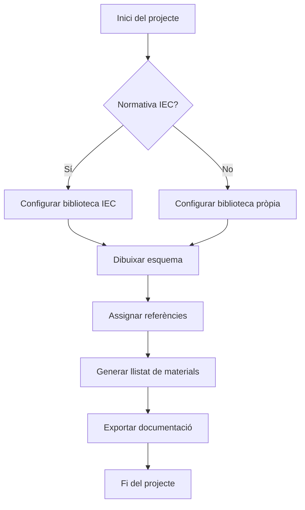

# Introducció al Disseny d'Esquemes Elèctrics amb EPLAN

*Curs 2025/2026 · David Mallén Julve*

---

## 1. Fonaments de l'enginyeria automatitzada

### 1.1. Què és l'enginyeria automatitzada?

L'ús de programari com EPLAN permet passar del simple dibuix a la **gestió de dades**.

!!! info "Definició"
    L'enginyeria automatitzada integra el disseny elèctric amb la gestió de dades del projecte, permetent la generació automàtica de documentació i llistats de materials.

Entre les seues principals capacitats trobem:

- Gestió integral de projectes electrotècnics.
- Generació automàtica de llistats de materials.
- Integració amb sistemes de fabricació de quadres.

### 1.2. L'entorn de treball

Abans de començar, cal configurar els recursos següents per a treballar correctament:

- La **biblioteca de símbols** basada en la normativa IEC.
- El **format de caixetí** normalitzat per al centre.
- La **graella de connexions** per a l'ús de l'*autoconnecting*.

!!! warning "Atenció"
    Si no configureu correctament la biblioteca de símbols IEC, els esquemes generats no compliran la normativa vigent.

### 1.3. Exemple de muntatge industrial

A continuació es mostra una imatge d'un quadre elèctric real per identificar els components que dibuixarem:


*Imatge sota llicència Creative Commons (CC)*

---

## 2. Treball amb EPLAN

### 2.1. Inserció de components pas a pas

Per a dibuixar el nostre esquema seguirem aquest ordre:

1. Seleccionar el símbol desitjat al menú lateral.
2. Col·locar l'element sobre la graella activa.
3. Assignar una referència única (per exemple, `-Q1`).

!!! tip "Consell"
    Utilitza la tecla `Tab` per canviar ràpidament entre els camps de la finestra de propietats del component.

!!! danger "Important"
    Mai oblideu omplir la **"Referència d'article"** a cada component; d'aquesta manera el llistat de la compra es generarà sense errors.

### 2.2. Exemple de codi: script d'exportació de materials

El següent script Python permet exportar el llistat de materials d'un projecte EPLAN a CSV:

```python title="exportar_materials.py"
import csv
import eplan_api  # (1)!

def exportar_llistat(projecte, fitxer_sortida):
    components = projecte.get_components()  # (2)!
    with open(fitxer_sortida, 'w', newline='') as f:
        writer = csv.writer(f)
        writer.writerow(['Referència', 'Descripció', 'Quantitat'])
        for comp in components:
            writer.writerow([
                comp.referencia,
                comp.descripcio,
                comp.quantitat
            ])
    print(f"Exportat a {fitxer_sortida}")  # (3)!
```

1. Importem la llibreria de l'API d'EPLAN.
2. Obtenim tots els components del projecte actiu.
3. Confirmem que l'exportació ha finalitzat correctament.

### 2.3. Flux del procés de disseny

El diagrama següent mostra el flux de treball típic en un projecte EPLAN:



### 2.4. Preguntes freqüents

???+ note "Com afegir un nou component al projecte?"
    Per afegir un nou component, obre el menú lateral de símbols, cerca el component per nom o referència IEC, i arrossega'l sobre l'esquema actiu.

??? warning "Què faig si no trobe el símbol a la biblioteca?"
    Si el símbol no es troba a la biblioteca estàndard IEC, pots crear-ne un de personalitzat des de **Eines → Editor de símbols** o importar una biblioteca de tercers.

??? tip "Puc treballar en múltiples pàgines alhora?"
    Sí. EPLAN permet obrir diverses pàgines en pestanyes independents. Usa `Ctrl+Tab` per navegar entre elles ràpidament.

### 2.5. Vídeo de suport

Podeu veure el procés d'edició detallat en el següent recurs extern:

[Clica aquí per a veure el tutorial d'EPLAN a YouTube](https://www.youtube.com/watch?v=zbe4EWKrjB8)

!!! note "Nota"
    Recordeu activar els subtítols per a una millor comprensió del vídeo.

---

## 3. Document complet

[⬇ Veure PDF](index.pdf){target="_blank"}
